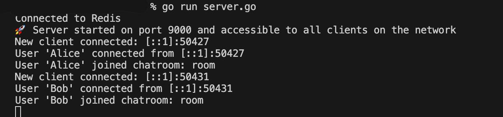
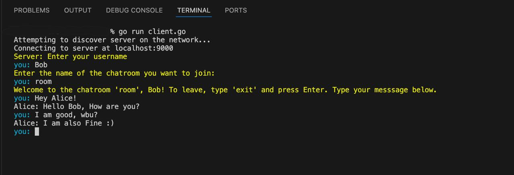
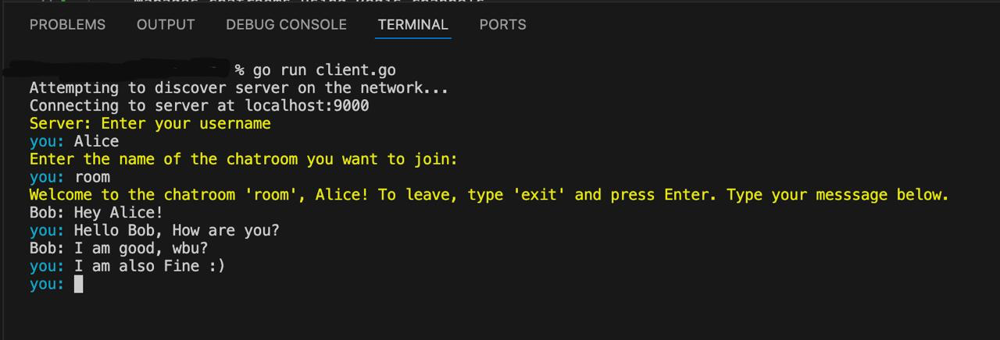

# NodeChat

NodeChat is a simple, real-time chat application that allows users on the same LAN to communicate through a centralized server. It uses **Redis** for managing chatrooms and message delivery.

---

## Features
- **LAN Chat**: Chat with users on the same Wi-Fi or LAN network.
- **Server Discovery**: Clients automatically find the server using UDP broadcasting.
- **Chatrooms**: Join specific chatrooms to communicate with others. To leave a chatroom, type `exit`.
- **Real-Time Messaging**: Messages are delivered instantly using Redis Pub/Sub.
- **Exit Command**: Leave the chatroom by typing `exit`.

---

## How It Works
1. **Server**:
   - Broadcasts its IP for discovery.
   - Manages chatrooms using Redis channels.
   - Forwards messages between clients.

2. **Client**:
   - Discovers the server via UDP broadcast.
   - Connects to the server and joins a chatroom.
   - Sends and receives messages in real-time.

3. **Redis**:
   - Acts as a message broker.
   - Manages chatrooms and distributes messages.

-------

## Example:

Server Output:

Client 1 Output:

Client 2 Output:

